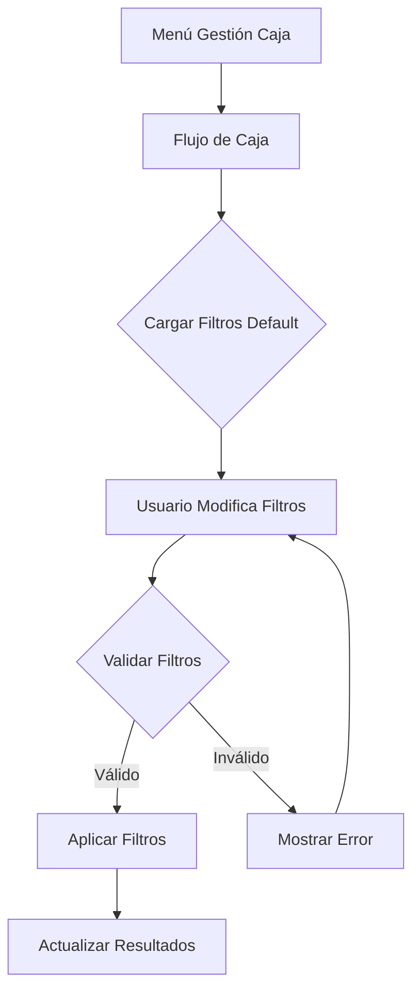

## 1. Product Overview
Nuevo submenú "Flujo de caja" para el sistema de gestión contable. Permite visualizar el flujo de ingresos y egresos por tipo de caja y período, manteniendo consistencia visual con la interfaz existente de Caja Mayor.

## 2. Core Features

### 2.1 User Roles
| Role | Registration Method | Core Permissions |
|------|---------------------|------------------|
| Usuario Contable | Sistema interno | Acceso a gestión de caja y reportes |
| Administrador | Sistema interno | Acceso completo a todas las funciones de caja |

### 2.2 Feature Module
El submenú Flujo de caja consiste en:
1. **Página Flujo de Caja**: cabecera con título, filtros de año, tipo de caja multiselect, radio button ingresos/egresos, y tabla de resultados.

### 2.3 Page Details
| Page Name | Module Name | Feature description |
|-----------|-------------|---------------------|
| Flujo de Caja | Cabecera | Mostrar título "Flujo de Caja", mantener mismo estilo visual que cajamayornew sin botón Nuevo |
| Flujo de Caja | Filtro Año | Desplegable automático con años desde el actual hasta 5 años atrás, default año concurrente, capturar como int |
| Flujo de Caja | Filtro Tipo Caja | Multicheck desplegable con lista de tipos de caja, validación requerida (mínimo uno), guardar como lista de int de ids, default todos seleccionados |
| Flujo de Caja | Filtro Ingresos/Egresos | Radio button con 3 opciones: Todos (null), Ingresos ('I'), Egresos ('E'), default Todos |
| Flujo de Caja | Grid Resultados | Tabla que mostrará el flujo de caja según filtros aplicados (especificaciones en siguiente fase) |

## 3. Core Process
### Flujo de Usuario Contable
1. Usuario accede al menú Gestión de Caja
2. Selecciona submenú "Flujo de Caja"
3. Sistema carga página con filtros default (año actual, todos los tipos de caja, todos los movimientos)
4. Usuario puede modificar filtros:
   - Cambiar año (2021-2025)
   - Seleccionar/deseleccionar tipos de caja (mínimo 1 requerido)
   - Cambiar tipo de movimiento (Todos/Ingresos/Egresos)
5. Sistema valida que al menos un tipo de caja esté seleccionado
6. Aplicar filtros y actualizar resultados

## 4. User Interface Design
### 4.1 Design Style
- **Colores**: Mantener paleta existente del sistema (primario azul, secundario gris)
- **Estilo de botones**: Redondeados, mismo estilo que cajamayornew
- **Tipografía**: Fuente del sistema, tamaños consistentes
- **Layout**: Card-based para filtros, tabla para resultados
- **Iconos**: Usar iconos existentes del sistema para consistencia

### 4.2 Page Design Overview
| Page Name | Module Name | UI Elements |
|-----------|-------------|-------------|
| Flujo de Caja | Cabecera | Título "Flujo de Caja", mismo padding y márgenes que cajamayornew, sin botón de acción |
| Flujo de Caja | Filtro Año | Select dropdown, ancho 150px, label "Año" |
| Flujo de Caja | Filtro Tipo Caja | Multi-select dropdown con checkboxes, label "Tipos de Caja", validación visual en rojo si vacío |
| Flujo de Caja | Filtro Movimiento | Radio buttons horizontales: "Todos" | "Ingresos" | "Egresos", default seleccionado "Todos" |

### 4.3 Responsiveness
- Desktop-first approach
- Adaptación automática para tablets y móviles
- Filtros apilados verticalmente en dispositivos móviles