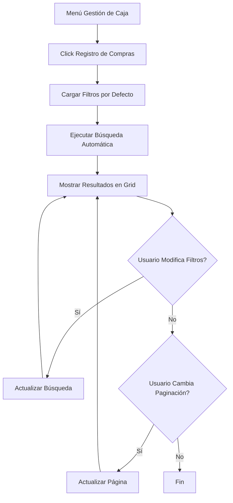

## 1. Product Overview

Submódulo de Registro de Compras dentro de la Gestión de Caja que permite consultar y filtrar los registros de compras realizadas por período, proveedor y tipo de caja.

## 2. Core Features

### 2.1 User Roles

| Role          | Registration Method | Core Permissions                      |
| ------------- | ------------------- | ------------------------------------- |
| Administrador | Sistema interno     | Acceso completo a Registro de Compras |
| Usuario Caja  | Sistema interno     | Consulta de registros de compras      |

### 2.2 Feature Module

El submódulo de Registro de Compras consiste en las siguientes páginas:

1. **Página de Registro de Compras**: Filtros de búsqueda avanzados y tabla de resultados con paginación.

### 2.3 Page Details

| Page Name           | Module Name             | Feature description                                                                           |
| ------------------- | ----------------------- | --------------------------------------------------------------------------------------------- |
| Registro de Compras | Header Section          | Diseño idéntico al módulo Flujo de Caja con título "Registro de Compras"                      |
| Registro de Compras | Filtro Año              | Lista desplegable con últimos 5 años, selecciona año actual por defecto                       |
| Registro de Compras | Filtro Mes              | Lista desplegable con meses (01-12), selecciona mes anterior por defecto                      |
| Registro de Compras | Filtro Fechas           | Datepicker para fecha inicial (primer día del período) y fecha final (último día del período) |
| Registro de Compras | Filtro Proveedor        | Autocomplete para seleccionar proveedores con ícono de limpieza, valor por defecto null       |
| Registro de Compras | Filtro Tipo Caja        | Select para tipos de caja, sin selección por defecto                                          |
| Registro de Compras | Grid de Resultados      | Tabla paginada con datos de compras, page=1 y pageSize=5 por defecto                          |
| Registro de Compras | Botón Limpiar           | Ícono que limpia filtros de fecha estableciendo valores a null                                |
| Registro de Compras | Botón Limpiar Proveedor | Ícono que limpia el filtro de proveedor estableciendo valor a null                            |

## 3. Core Process

### Flujo de Usuario

1. El usuario accede al submenú "Registro de Compras" desde el menú de Gestión de Caja
2. El sistema carga automáticamente los filtros con valores por defecto:

   * Año actual

   * Mes anterior al actual

   * Fecha inicial = primer día del período

   * Fecha final = último día del período

   * Proveedor = null

   * Tipo de caja = sin selección
3. El sistema ejecuta la búsqueda automática con los filtros por defecto
4. El usuario puede modificar cualquier filtro y el sistema actualiza la búsqueda
5. El usuario puede limpiar filtros individuales usando los íconos de limpieza
6. La grilla muestra los resultados con paginación

## 4. User Interface Design

### 4.1 Design Style

* **Colores**: Misma paleta que módulo Flujo de Caja (primario azul, secundario gris)

* **Botones**: Estilo consistente con el resto de la aplicación (redondeados o 3D según estilo actual)

* **Fuentes**: Misma familia tipográfica del sistema, tamaños estándar

* **Layout**: Card-based para filtros, tabla responsiva para resultados

* **Íconos**: Estilo lineal consistente, incluir íconos de limpieza (X o basurero)

### 4.2 Page Design Overview

| Page Name           | Module Name     | UI Elements                                                                                                                                |
| ------------------- | --------------- | ------------------------------------------------------------------------------------------------------------------------------------------ |
| Registro de Compras | Header          | Título "Registro de Compras", mismo diseño que Flujo de Caja                                                                               |
| Registro de Compras | Filtros         | Grid 2x3: Año(select), Mes(select), Fecha Inicial(datepicker), Fecha Final(datepicker), Proveedor(autocomplete+limpiar), Tipo Caja(select) |
| Registro de Compras | Grid Resultados | Tabla con columnas: Fecha, Proveedor, Tipo Caja, Monto, Acciones, con paginación inferior                                                  |

### 4.3 Responsiveness

* Desktop-first design

* Adaptación para tablets (responsive breakpoints)

* Optimización de filtros para pantallas pequeñas (stack vertical en móvil)

* Tabla horizontal scroll en dispositivos móviles

