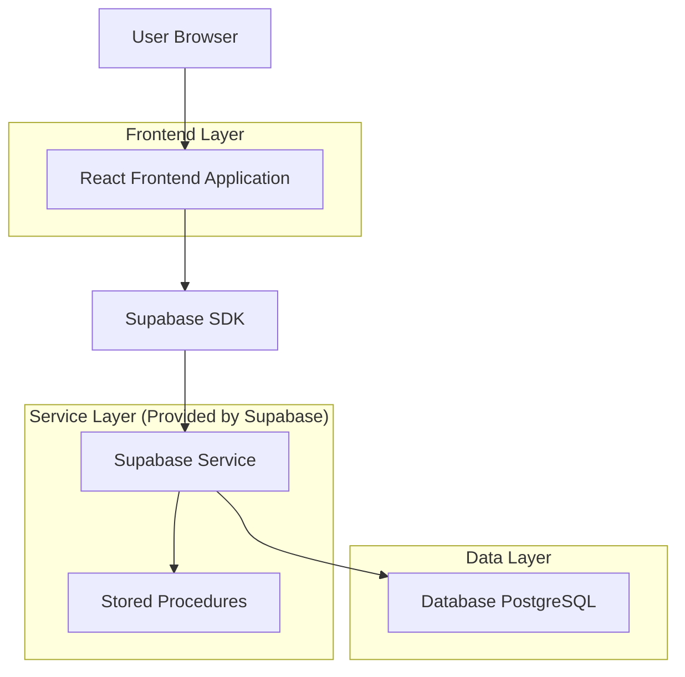
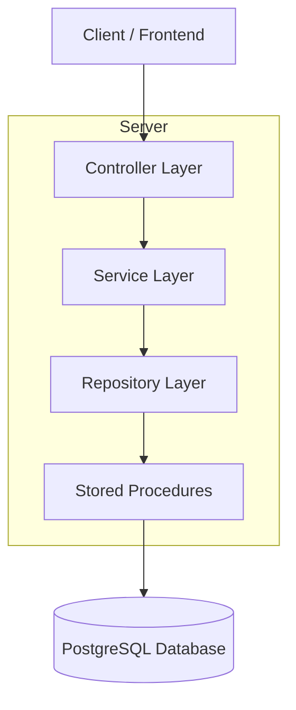
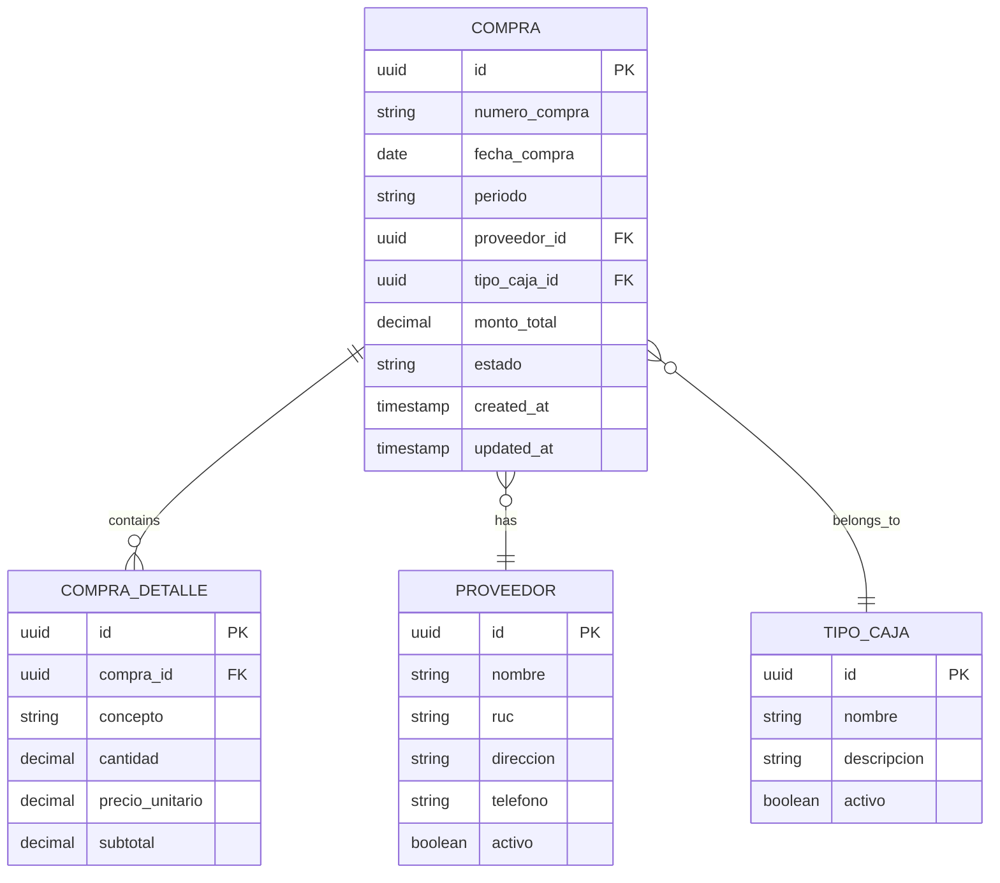

## 1. Architecture design



## 2. Technology Description
- Frontend: React@18 + tailwindcss@3 + vite
- Initialization Tool: vite-init
- Backend: Supabase (PostgreSQL)
- UI Components: Autocomplete existente del proyecto, Datepickers, Select components

## 3. Route definitions
| Route | Purpose |
|-------|---------|
| /gestion-caja/registro-compras | Página de Registro de Compras con filtros y tabla de resultados |

## 4. API definitions

### 4.1 Core API

**Obtener Registros de Compras**
```
POST /api/compras/registros
```

Request:
| Param Name| Param Type  | isRequired  | Description |
|-----------|-------------|-------------|-------------|
| periodo   | string      | true        | Período en formato yyyyMM (ej: 202509) |
| fechaInicial | date     | false       | Fecha inicial del filtro (formato ISO) |
| fechaFinal | date       | false       | Fecha final del filtro (formato ISO) |
| proveedorId | string    | false       | ID del proveedor seleccionado |
| tipoCajaId | string     | false       | ID del tipo de caja |
| page      | integer     | true        | Número de página (default: 1) |
| pageSize  | integer     | true        | Tamaño de página (default: 5) |

Response:
| Param Name| Param Type  | Description |
|-----------|-------------|-------------|
| data      | array       | Array de objetos de compras |
| total     | integer     | Total de registros |
| page      | integer     | Página actual |
| pageSize  | integer     | Tamaño de página |

Example
```json
{
  "periodo": "202509",
  "fechaInicial": "2025-09-01",
  "fechaFinal": "2025-09-30",
  "proveedorId": "123e4567-e89b-12d3-a456-426614174000",
  "tipoCajaId": "456e7890-e89b-12d3-a456-426614174111",
  "page": 1,
  "pageSize": 5
}
```

## 5. Server architecture diagram


## 6. Data model

### 6.1 Data model definition


### 6.2 Data Definition Language

**Tabla de Compras (compras)**
```sql
-- create table
CREATE TABLE compras (
    id UUID PRIMARY KEY DEFAULT gen_random_uuid(),
    numero_compra VARCHAR(50) NOT NULL,
    fecha_compra DATE NOT NULL,
    periodo VARCHAR(6) NOT NULL, -- formato yyyyMM
    proveedor_id UUID REFERENCES proveedores(id),
    tipo_caja_id UUID REFERENCES tipos_caja(id),
    monto_total DECIMAL(10,2) NOT NULL,
    estado VARCHAR(20) DEFAULT 'ACTIVO' CHECK (estado IN ('ACTIVO', 'ANULADO')),
    created_at TIMESTAMP WITH TIME ZONE DEFAULT NOW(),
    updated_at TIMESTAMP WITH TIME ZONE DEFAULT NOW()
);

-- create indexes
CREATE INDEX idx_compras_periodo ON compras(periodo);
CREATE INDEX idx_compras_fecha ON compras(fecha_compra);
CREATE INDEX idx_compras_proveedor ON compras(proveedor_id);
CREATE INDEX idx_compras_tipo_caja ON compras(tipo_caja_id);

-- grant permissions
GRANT SELECT ON compras TO anon;
GRANT ALL PRIVILEGES ON compras TO authenticated;
```

**Stored Procedure para obtener registros de compras**
```sql
CREATE OR REPLACE FUNCTION sp_obtener_registros_compras(
    p_periodo VARCHAR(6),
    p_fecha_inicial DATE DEFAULT NULL,
    p_fecha_final DATE DEFAULT NULL,
    p_proveedor_id UUID DEFAULT NULL,
    p_tipo_caja_id UUID DEFAULT NULL,
    p_page INTEGER DEFAULT 1,
    p_page_size INTEGER DEFAULT 5
)
RETURNS TABLE (
    total_records INTEGER,
    compra_id UUID,
    numero_compra VARCHAR,
    fecha_compra DATE,
    proveedor_nombre VARCHAR,
    tipo_caja_nombre VARCHAR,
    monto_total DECIMAL,
    estado VARCHAR
) AS $$
BEGIN
    RETURN QUERY
    SELECT 
        COUNT(*) OVER() as total_records,
        c.id as compra_id,
        c.numero_compra,
        c.fecha_compra,
        p.nombre as proveedor_nombre,
        tc.nombre as tipo_caja_nombre,
        c.monto_total,
        c.estado
    FROM compras c
    LEFT JOIN proveedores p ON c.proveedor_id = p.id
    LEFT JOIN tipos_caja tc ON c.tipo_caja_id = tc.id
    WHERE c.periodo = p_periodo
        AND (p_fecha_inicial IS NULL OR c.fecha_compra >= p_fecha_inicial)
        AND (p_fecha_final IS NULL OR c.fecha_compra <= p_fecha_final)
        AND (p_proveedor_id IS NULL OR c.proveedor_id = p_proveedor_id)
        AND (p_tipo_caja_id IS NULL OR c.tipo_caja_id = p_tipo_caja_id)
        AND c.estado = 'ACTIVO'
    ORDER BY c.fecha_compra DESC, c.numero_compra DESC
    LIMIT p_page_size OFFSET (p_page - 1) * p_page_size;
END;
$$ LANGUAGE plpgsql;