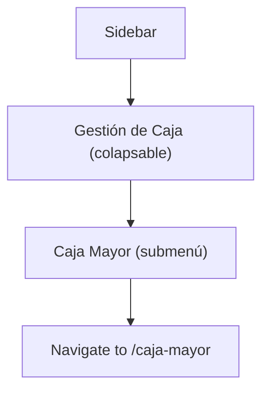

## 1. Product Overview
Actualización del sidebar de navegación para reorganizar la sección de Caja Mayor dentro de un nuevo menú padre "Gestión de Caja".

## 2. Core Features

### 2.1 Feature Module
Los cambios en el sidebar consisten en:
1. **Gestión de Caja** (nuevo menú padre): elemento colapsable en el sidebar
2. **Caja Mayor** (submenú): mantiene su funcionalidad actual pero ubicado como elemento hijo

### 2.2 Page Details
| Page Name | Module Name | Feature description |
|-----------|-------------|---------------------|
| Sidebar | Gestión de Caja | Menú padre colapsable con icono de carpeta/caja. Al hacer clic expande/contrae para mostrar elementos hijos. |
| Sidebar | Caja Mayor | Submenú que mantiene navegación actual sin cambios en ruta. Se muestra indentado bajo Gestión de Caja. |

## 3. Core Process
**Flujo de usuario:**
1. Usuario visualiza el sidebar con el nuevo menú "Gestión de Caja"
2. Usuario hace clic en "Gestión de Caja" para expandir el menú
3. Usuario visualiza "Caja Mayor" como submenú indentado
4. Usuario hace clic en "Caja Mayor" para navegar (misma ruta actual)

## 4. User Interface Design
### 4.1 Design Style
- **Colores**: Mantener esquema actual (fondo azul oscuro gradiente, texto blanco)
- **Estado activo**: Fondo rojo con texto blanco (como elemento actual)
- **Estado hover**: Fondo gris azulado (como elemento resaltado)
- **Iconos**: 
  - Gestión de Caja: Icono de carpeta/caja en blanco
  - Caja Mayor: Mantener icono actual de moneda/dinero en rojo
- **Indentación**: 16-24px para submenús

### 4.2 Page Design Overview
| Page Name | Module Name | UI Elements |
|-----------|-------------|-------------|
| Sidebar | Gestión de Caja | Texto blanco, icono a la izquierda, chevron derecha indicando estado colapsable/expandible |
| Sidebar | Caja Mayor | Texto blanco indentado, icono rojo de dinero, sin cambios en comportamiento de navegación |