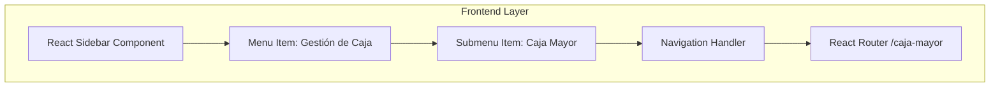

## 1. Architecture design



## 2. Technology Description
- Frontend: React@18 + tailwindcss@3 + vite
- Initialization Tool: vite-init
- Backend: None (solo cambios de UI)
- State Management: React useState para control de expansión de menú

## 3. Route definitions
| Route | Purpose |
|-------|---------|
| /caja-mayor | Mantiene ruta actual de Caja Mayor (sin cambios) |

## 4. Component Structure

### 4.1 Menu Item Component Props
```typescript
interface MenuItem {
  id: string;
  label: string;
  icon: React.ComponentType;
  route?: string;
  children?: MenuItem[];
  isExpanded?: boolean;
  onToggle?: () => void;
}
```

### 4.2 Sidebar State Management
```typescript
interface SidebarState {
  expandedMenus: Record<string, boolean>;
  activeRoute: string;
}
```

## 5. Implementation Details

### 5.1 Estructura de Datos del Menú
```javascript
const menuItems = [
  {
    id: 'gestion-caja',
    label: 'Gestión de Caja',
    icon: FolderIcon,
    children: [
      {
        id: 'caja-mayor',
        label: 'Caja Mayor',
        icon: CurrencyIcon,
        route: '/caja-mayor'
      }
    ]
  }
];
```

### 5.2 CSS Classes para Indentación
```css
.submenu-item {
  padding-left: 2rem; /* 32px de indentación */
  font-size: 0.875rem; /* text-sm */
}

.menu-item-expanded .chevron {
  transform: rotate(90deg);
  transition: transform 0.2s ease;
}
```