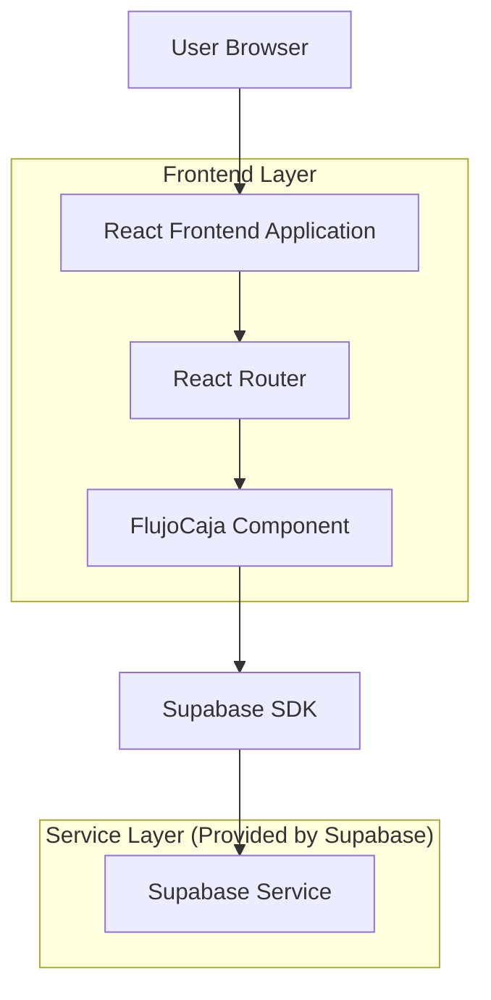
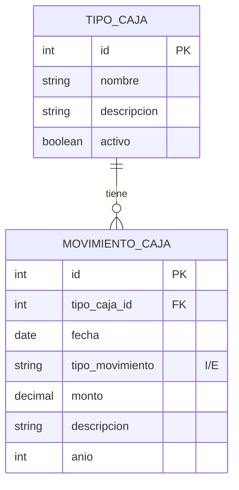

## 1. Architecture design



## 2. Technology Description
- Frontend: React@18 + TypeScript + TailwindCSS@3 + Vite
- Initialization Tool: vite-init
- Backend: Supabase (PostgreSQL)
- Routing: React Router DOM
- State Management: React Hooks (useState, useEffect)

## 3. Route definitions
| Route | Purpose |
|-------|---------|
| /gestion-caja/flujo-caja | Página principal de Flujo de Caja, muestra filtros y tabla de resultados |
| /gestion-caja | Menú principal de gestión de caja (redirección) |

## 4. Component Structure

### 4.1 FlujoCaja Component
```typescript
interface FlujoCajaProps {
  className?: string;
}

interface FlujoCajaState {
  anioSeleccionado: number;
  tiposCajaSeleccionados: number[];
  tipoMovimiento: 'I' | 'E' | null;
  tiposCajaDisponibles: TipoCaja[];
  errores: {
    tiposCaja?: string;
  };
}

interface TipoCaja {
  id: number;
  nombre: string;
  descripcion?: string;
}
```

### 4.2 API Integration Methods
```typescript
// Obtener lista de tipos de caja
const obtenerTiposCaja = async (): Promise<TipoCaja[]> => {
  const { data, error } = await supabase
    .from('tipos_caja')
    .select('id, nombre, descripcion')
    .order('nombre');
  
  if (error) throw error;
  return data;
};

// Obtener flujo de caja con filtros
const obtenerFlujoCaja = async (filtros: {
  anio: number;
  tiposCaja: number[];
  tipoMovimiento: 'I' | 'E' | null;
}) => {
  let query = supabase
    .from('vista_flujo_caja')
    .select('*')
    .eq('anio', filtros.anio)
    .in('tipo_caja_id', filtros.tiposCaja);
  
  if (filtros.tipoMovimiento) {
    query = query.eq('tipo_movimiento', filtros.tipoMovimiento);
  }
  
  const { data, error } = await query.order('fecha');
  if (error) throw error;
  return data;
};
```

## 5. Data model

### 5.1 Data model definition


### 5.2 Data Definition Language

Tabla tipos_caja:
```sql
CREATE TABLE tipos_caja (
    id SERIAL PRIMARY KEY,
    nombre VARCHAR(100) NOT NULL,
    descripcion TEXT,
    activo BOOLEAN DEFAULT true,
    created_at TIMESTAMP WITH TIME ZONE DEFAULT NOW()
);

-- Datos iniciales de tipos de caja
INSERT INTO tipos_caja (nombre, descripcion) VALUES
    ('Caja Principal', 'Caja principal de la institución'),
    ('Caja Chica', 'Caja para gastos menores'),
    ('Caja Banco', 'Cuentas bancarias'),
    ('Caja Recaudación', 'Caja para recaudación de fondos');

-- Permisos Supabase
GRANT SELECT ON tipos_caja TO anon;
GRANT ALL PRIVILEGES ON tipos_caja TO authenticated;
```

Vista vista_flujo_caja:
```sql
CREATE OR REPLACE VIEW vista_flujo_caja AS
SELECT 
    mc.id,
    mc.tipo_caja_id,
    tc.nombre as tipo_caja_nombre,
    mc.fecha,
    mc.tipo_movimiento,
    mc.monto,
    mc.descripcion,
    EXTRACT(YEAR FROM mc.fecha) as anio,
    EXTRACT(MONTH FROM mc.fecha) as mes
FROM movimientos_caja mc
JOIN tipos_caja tc ON mc.tipo_caja_id = tc.id
WHERE tc.activo = true;

-- Permisos Supabase
GRANT SELECT ON vista_flujo_caja TO anon;
GRANT SELECT ON vista_flujo_caja TO authenticated;
```

## 6. Validation Rules

### 6.1 Frontend Validation
- Año: debe estar entre (año actual - 5) y año actual
- Tipos de Caja: array debe tener al menos 1 elemento
- Tipo Movimiento: puede ser null, 'I', o 'E'

### 6.2 Error Messages
```typescript
const VALIDATION_MESSAGES = {
  TIPOS_CAJA_REQUIRED: 'Debe seleccionar al menos un tipo de caja',
  ANIO_INVALIDO: 'El año debe estar entre {min} y {max}'
};
```

## 7. State Management Pattern
```typescript
// Hook personalizado para manejar el estado de filtros
const useFlujoCajaFiltros = () => {
  const anioActual = new Date().getFullYear();
  const [anio, setAnio] = useState(anioActual);
  const [tiposCaja, setTiposCaja] = useState<number[]>([]);
  const [tipoMovimiento, setTipoMovimiento] = useState<'I' | 'E' | null>(null);
  
  const anosDisponibles = Array.from({length: 6}, (_, i) => anioActual - i);
  
  const validarFiltros = () => {
    return tiposCaja.length > 0;
  };
  
  return {
    anio, setAnio,
    tiposCaja, setTiposCaja,
    tipoMovimiento, setTipoMovimiento,
    anosDisponibles,
    validarFiltros
  };
};
```